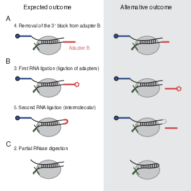

# comp-hiclip

The repo contains code for the computational STAU1 hiCLIP project.

## Overview

Our starting point is that hybrids remain either unidentified or mis-identified as non-hybrids in the published hiCLIP analysis:

## Structure

* `linker` contains code for the linker hybrids
* `no_linker` contains code for the no-linker hybrids
* `no_rnase` contains code for the no RNase hybrids (short-range structures)
* `paris` contains code for the PARIS hybrids
* `ref` contains code to generate the reference files
